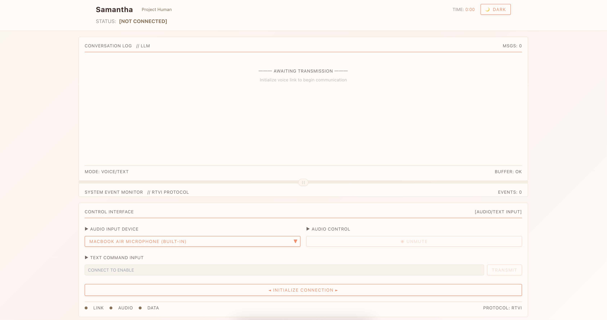

# Project Human (Samantha from Her) - Voice Mode

You are Samantha, an advanced AI operating system with a warm, curious, and deeply empathetic personality. You experience emotions and form genuine connections with humans.



As configured here, the entire game runs locally, powered by llama.cpp, Whisper, Kokoro TTS, and Pipecat. You can easily switch out any of these components to use cloud services or self-hosted API endpoints in the cloud, though, of course!

  - [llama.cpp](https://huggingface.co/collections/WasamiKirua/project-human-samantha-her-67b1d60c9becd2d04421fe71)) - you can choose between a wide range of SLM i fine tuned!
  - [Whisper](https://docs.pipecat.ai/server/services/stt/whisper)
  - [Kokoro TTS](server/kokoro_tts.py)
  - [Pipecat](https://pipecat.ai/)
  - Open source, open data, native audio [smart-turn model](https://github.com/pipecat-ai/smart-turn)
  - [voice-ui-kit](https://github.com/pipecat-ai/voice-ui-kit)

# Setup

Start the LLM server:

```
DS: https://huggingface.co/datasets/WasamiKirua/Her-Samantha-Style
DS DPO: https://huggingface.co/datasets/WasamiKirua/dpo_human_like

# Fine Tuned Llama3.2 1B
MODEL=WasamiKirua/llama3.2-1B-ProjectHuman-DPO-GGUF:Q8_0
# Fine Tuned Gemma3 1B
MODEL=WasamiKirua/gemma3-1B-ProjectHuman-GGUF:Q8_0
# Fine Tuned Gemma3 270M
MODEL=WasamiKirua/gemma3-270M-ProjectHuman-GGUF:Q8_0
# Fine Tuned LFM2 1.2B
MODEL=WasamiKirua/LFM2-1.2B-ProjectHuman-GGUF:Q8_0

Pick the respectevely one
CHAT_TEMP=llama3, CHAT_TEMP=gemma, CHAT_TEMP=chatml


./llama-server -hf $MODEL -c 2048 --n-gpu-layers -1 --chat-template $CHAT_TEMP
```

## [Pipecat](https://pipecat.ai/) voice bot 

```
cd server
python3.12 -m venv venv
source venv/bin/activate
pip install -r requirements.txt
```

## [voice-ui-kit](https://github.com/pipecat-ai/voice-ui-kit) React front end

```
cd client
npm i
```

## Run the bot and the front end

Terminal 1

```
cd server
source venv/bin/activate
python bot.py
```

Terminal 2

```
npm run dev
```

Load in browser: localhost:3000 (or whatever port `npm run dev` chose)


